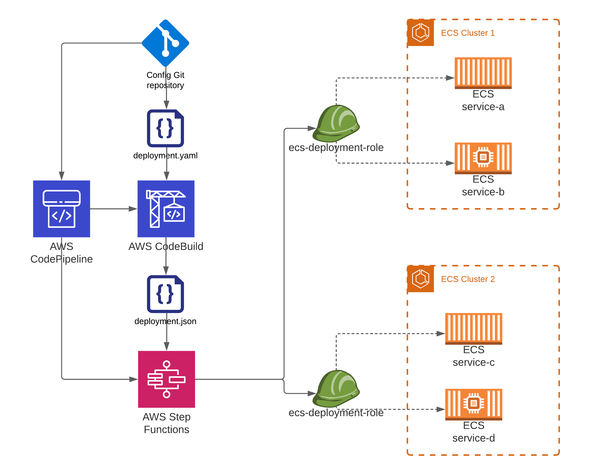
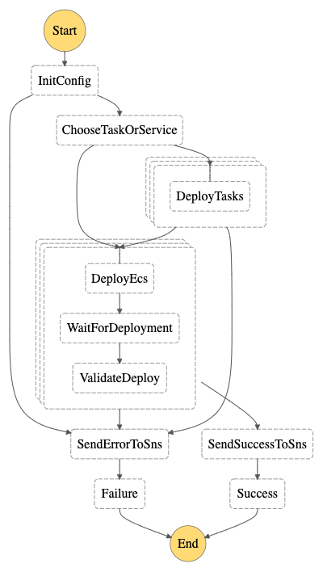
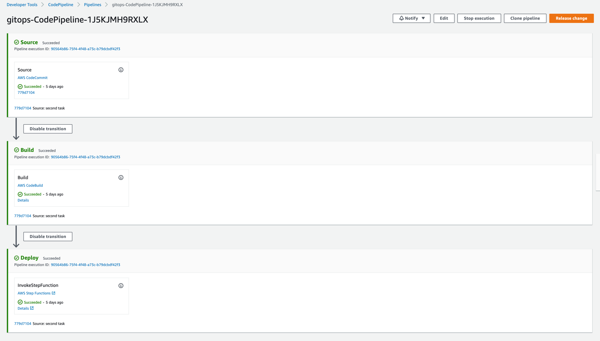
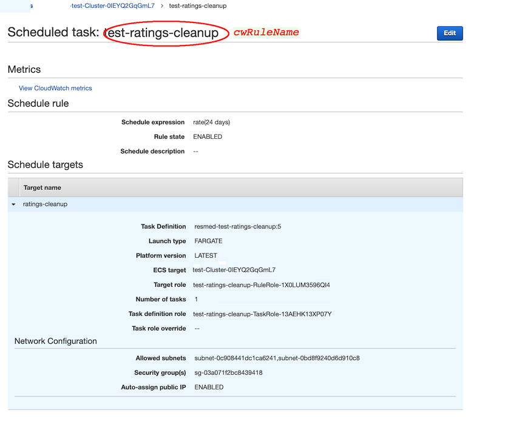
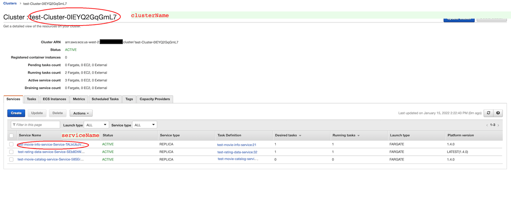
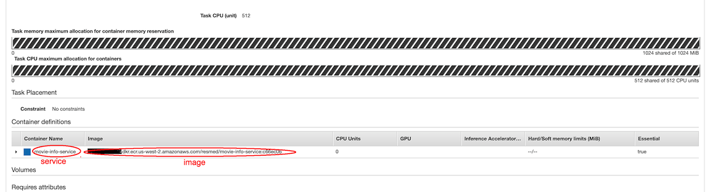

# GitOps on ECS: A Git driven approach to do continuous deployment across multiple ECS services

## Problem statement
Certain Organizations need to test and deploy multiple, sometimes hundreds of micro-services simultaneously. 
This could be because of regulatory or compliance requirements where the organization is mandated to test numerous services together and then release it in one go. 
Using the traditional strategy of deploying one pipeline per micro-service requires these organizations to coordinate hundreds of pipelines to do a single production release. 
This increases the deployment window, deployment complexity, and requires coordination from multiple teams that own these micro-services. 
For example, if 50 services must be deployed in a release, then it would require the team to go and approve 50 production approval gates, which can be a time-consuming and error-prone process. 
In the case of rollback, it would take considerable time to go and individually rollback each of the pipelines to do a full rollback of the release. 
These organizations need the ability to reliably deploy multiple services together without the complexity of having to orchestrate numerous pipelines during release. 
Certain GitOps deployment tools like ArgoCD can facilitate the deployment of multiple services in the Kubernetes space. 
However, these tools are limited in the Amazon ECS space. This post attempts to create a single pipeline to provide the ability to deploy multiple Amazon ECS Fargate services and scheduled tasks simultaneously with Git as the source of truth. 
This is done to reduce the complexity associated with deploying multiple services in a release.

## Project statement
This project  demonstrates how to create a sample pipeline that
can do git driven configuration based continuous deployment across multiple ECS [Fargate services](https://docs.aws.amazon.com/AmazonECS/latest/developerguide/AWS_Fargate.html) 
and [scheduled tasks](https://docs.aws.amazon.com/AmazonECS/latest/developerguide/scheduling_tasks.html).
This pipeline is helpful for scenarios where hundreds of microservices needs to be deployed together when it might become 
very tedious to co-ordinate hundreds of pipelines each for a single microservice. This is essentially a **Continuous Deployment** (CD)
pipeline, it is assumed that you already have **Continuous Integration** (CI) pipelines that builds your images.


In this project we are using AWS [CodeCommit](https://aws.amazon.com/codecommit/) as our GitOps repository, 
however you can use any git based repository that integrates with CodePipeline like [GitHub](https://github.com/), [BitBucket](https://bitbucket.org/).

The CodeCommit repository is used as _source_ stage for CodePipeline. CodeCommit contains a file called _deployment.yaml_ that contains your ECS
infrastructure information and the build images you want to deploy (sample _deployment.yaml_ provided) in your release. 
CodeBuild stage converts the _deployment.yaml_ file to json and sends it as input to the Step
Function. [AWS CodePipeline provides ability to invoke AWS Step Functions](https://aws.amazon.com/about-aws/whats-new/2020/05/codepipeline-supports-invoking-step-functions-with-a-new-action-type/). 
[AWS Step Functions provide a way to execute parallel steps to accelerate workloads](https://aws.amazon.com/blogs/compute/accelerating-workloads-using-parallelism-in-aws-step-functions/)
which is used to deploy to multiple ECS services in parallel. The deployment step function
mimics [CodePipeline ECS Rolling Deployment](https://docs.aws.amazon.com/codepipeline/latest/userguide/ecs-cd-pipeline.html)
and runs parallel steps first for each scheduled task and then for each  ECS service to deploy the new images to the ECS.

As and when the deployment file is updated in Git, CodePipeline is triggered to perform deployments which updates ECS
services specified in the config.

### Solution Overview





### Prerequisites

In order to test the pipeline and its ability to deploy multiple ECS services, you will need multiple ECS Fargate services deployed in one or more ECS clusters.
Scheduled tasks is optional and need to be created if the scheduled tasks need to be deployed as a part of this pipeline. 
If you don't have ECS services running, AWS provides different ways to create it. I have listed a few below

- Create ECS services
  - [ECS Workshop](https://ecsworkshop.com/microservices/) - Hands on creation of ECS services with video tutorials.
  - [AWS CLI](https://docs.aws.amazon.com/AmazonECS/latest/developerguide/getting-started-fargate.html)
  - [Copilot](https://docs.aws.amazon.com/AmazonECS/latest/developerguide/getting-started-aws-copilot-cli.html) 
  - [CDK](https://docs.aws.amazon.com/AmazonECS/latest/developerguide/tutorial-ecs-web-server-cdk.html)
  - [ECS CLI](https://docs.aws.amazon.com/AmazonECS/latest/developerguide/ECS_CLI.html)
  - [CLOUDFORMATION](https://github.com/awslabs/ecs-refarch-continuous-deployment) 
  - [Also Helpful](https://github.com/aws-samples/aws-microservices-deploy-options#amazon-ecs-and-aws-fargate) 
- Create Scheduled tasks
  - [AWS CLI](https://docs.aws.amazon.com/AmazonECS/latest/developerguide/scheduled_tasks_cli_tutorial.html)

- You will also need docker images to deploy to ECS, refer this [blog](https://aws.amazon.com/blogs/devops/build-a-continuous-delivery-pipeline-for-your-container-images-with-amazon-ecr-as-source/)
to create a simple Continuous Integration pipeline to build your images.

To use the SAM CLI, you need the following tools:

* SAM CLI - [Install the SAM CLI](https://docs.aws.amazon.com/serverless-application-model/latest/developerguide/serverless-sam-cli-install.html)
* Python - [Install Python 3.8](https://www.python.org/downloads/)
* Docker - [Install Docker community edition](https://hub.docker.com/search/?type=edition&offering=community)

### Update IAM role permissions:
Note: SAM template creates an _EcsDeploymentRole_ IAM role , that is assumed by the StepFunction to deploy to ECS Services.
This role has as iam:PassRole, that is required to pass the role to ECS execution and task roles to do the actual deployment.

Since ECS services and execution and task IAM roles are not created as a part of this project, 
I am required to do a iam:PassRole on resource _*_ limited to services events.amazonaws.com ecs-tasks.amazonaws.com to provide a working template.
iam:PassRole on _*_ will be flagged by most security tools like cf-nag.

In order to fix this problem and limit the permission of the role, change the resource from _'*'_ to the list of ECS execution and task roles ARNs that are associated with your ECS services.  


### Deploy the sample pipeline

> **WARNING**:
> Cleanup resources once done working. This sample provisions S3, CodeCommit, CodeBuild, CodePipeline, Lambda, StepFunctions which can incur cost

To build and deploy your pipeline for the first time, checkout this repository and run the following in your shell:

```bash
sam build
sam deploy --guided --capabilities CAPABILITY_NAMED_IAM
```
More information about deploying a SAM project can be found [here](https://docs.aws.amazon.com/serverless-application-model/latest/developerguide/serverless-getting-started-hello-world.html) 

Once deployed a codepipeline as show below will be created



Next step is configure your GitOps repository.

The stack creates a CodeCommit repository, you can find the name in the output values displayed after SAM deployment.
[Git checkout](https://docs.aws.amazon.com/codecommit/latest/userguide/getting-started.html) the CodeCommit Repository and create a config file called _deployment.yaml_ in the default branch _main_.
Sample _deployment.yaml_ file is provided in this project. 
_tasks_ is optional array and only required if you have scheduled tasks.
If scheduled tasks exists then provide proper values for _service_, _cwRuleName_ & _image_. 
Provide proper values for _service_, _clusterName_, _serviceName_ & _image_ . Refer screenshots below if you are not clear on where to get the values for _deployment.yaml_.
In order to test the pipeline and demonstrate its ability to deploy multiple services you will need two or more services.
Specify the information in the _deployment.yaml_ and commit. This will trigger codepipeline, and it will deploy the image tags to the services.

```yaml
tasks:
  - service: rating-cleanup
    cwRuleName: test-rating-cleanup
    image: "11111111111.dkr.ecr.us-west-2.amazonaws.com/rating-cleanup:2.0.0"
services:
  - service: service-a
    clusterName: test-Cluster-0IEYQ2GqGmL7
    serviceName: test-movie-info-service-Service-TALkUbJVrBgS
    image: "11111111111.dkr.ecr.us-east-1.amazonaws.com/movie-info-service:4.0.0"
```





### Cleanup

To delete the sample pipeline that you created, use the AWS CLI. Assuming you used your project name for the stack
name, you can run the following:

```bash
sam delete
```

### Resources

See
the [AWS SAM developer guide](https://docs.aws.amazon.com/serverless-application-model/latest/developerguide/what-is-sam.html)
for an introduction to SAM specification, the SAM CLI, and serverless application concepts.

### Security

See [CONTRIBUTING](CONTRIBUTING.md#security-issue-notifications) for more information.

### License

This library is licensed under the MIT-0 License. See the LICENSE file.
